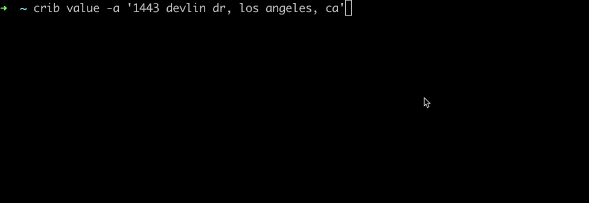

# crib
nice crib

## Installation
Navigate to the [latest release](https://github.com/peppys/crib/releases/latest) and download the binary for your OS.  
Assuming it's mac, here's how to install v1.0.2:
```shell
$ curl -L https://github.com/peppys/crib/releases/download/1.0.2/crib_1.0.2_Darwin_arm64.tar.gz --output crib.tar.gz 

$ tar -xzvf crib.tar.gz
```

## CLI Usage
```shell
$ ./crib value --help
Checks the estimated valuation of your property

Usage:
  cli value [flags]

Flags:
  -a, --address string   Address of your crib
  -h, --help             help for value
```

## Library Usage
```go
package main

import (
	"github.com/peppys/crib/pkg/crib"
	"github.com/peppys/crib/pkg/crib/estimators"
	"log"
)

func main() {
	c := crib.NewCrib(
		crib.WithEstimators(
			estimators.DefaultZillowEstimator(),
			estimators.DefaultRedfinEstimator(),
		),
	)

	estimates, err := c.Estimate("1443 delvin dr los angeles, ca")
	if err != nil {
		log.Fatal(err)
	}

	log.Printf("found estimates: %+v", estimates)
}
```

## CLI Demo  
  
